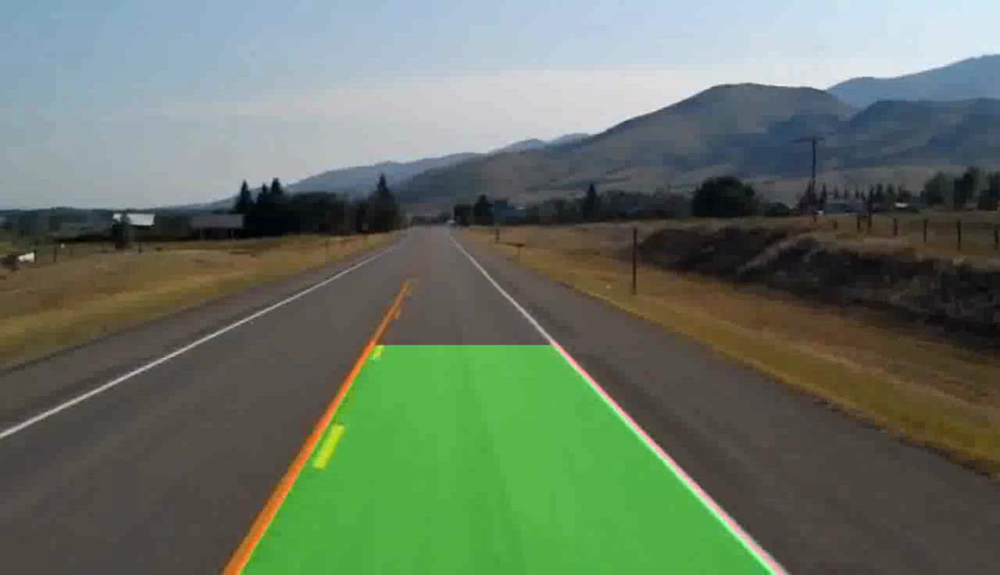
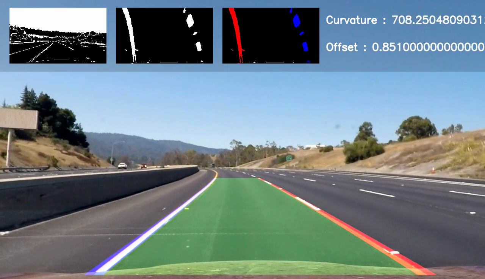
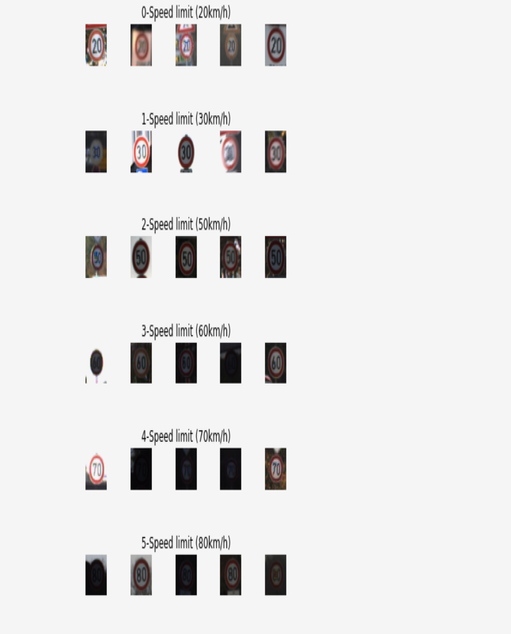
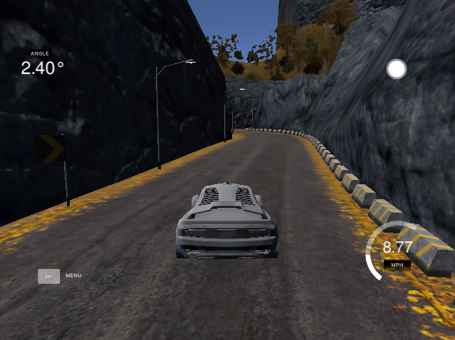

# AUtonomously-DRIving-CAr

This repository contains all my projects that I worked on during my course "The Complete Self Driving Car Course" on Udemy.

Course comprised of three projects: Basic Lane Line Detection, Traffic Sign Classification and Behaviour Cloning a self driving car in the open source Udacity Self Driving Car simulator.

The fourth project Advanced Lane Line Detection on roads was something I took up on my own out of the will to notch it up a little, by following tutorials online.

I hope to add more projects to this repository, pertaining to different utilities of a Self-Driving-Car.

## Contents

### [Project 1 - Finding Lane Lines on straight road](https://github.com/adithyagaurav/AuDriCa/tree/master/finding-basic-lanes)

Objective: Involves the detection of lane lines on a straight road using the popular Hough Transform technique using OpenCV.

### [Project 2 - Finding Lane Lines on a curved road](https://github.com/adithyagaurav/AuDriCa/tree/master/lanes-advanced)

Objective: Involves the detection of lane lines on a curved (or straight) road, compute vehicle offset and radius of curvature by taking advantage of powerful computer vision techniques such as perspecitve transform and window search method in OpenCV

### [Project 3 - Classify German Traffic Signs](https://github.com/adithyagaurav/AuDriCa/tree/master/traffic_signal)

Objective: Involves training a Convolutional Neural Network pertaining to LeNet architecture on a CUDA capable GPU to classify between 43 different classes of traffic signs prevalent on German roads. The model was trained using the Keras framework with TensorFlow backend.

### [Project 4 - Behavioural Cloning](https://github.com/adithyagaurav/AuDriCa/tree/master/behaviour_cloning)

Objective: Involves training the NVIDIA convolutional neural network model using data aurgmentation and batch generation techniques to predict steering angles for a self driving car, driving in the Open Source UDACITY Self Driving Car simulator on both lake and mountain tracks, by processing the pictures as captured by the cameras mounted on the hood of the simulated car. The model was trained on a GPU runtime provided by Google Colab by leveraging the Keras-2.2.4 framework supported by TensorFlow on the backend.

